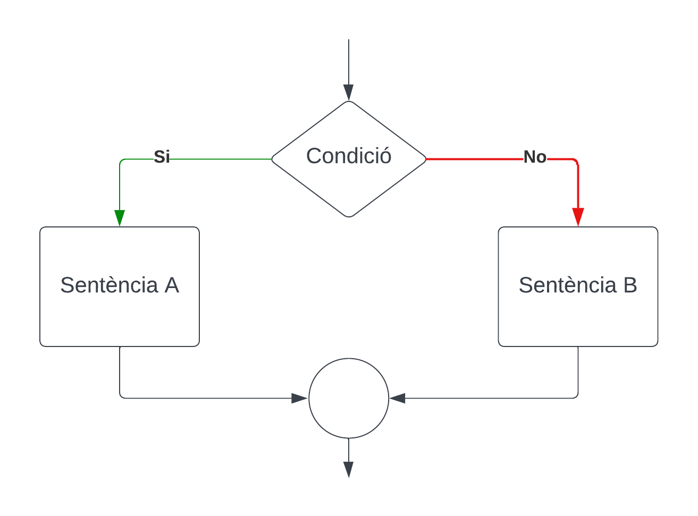
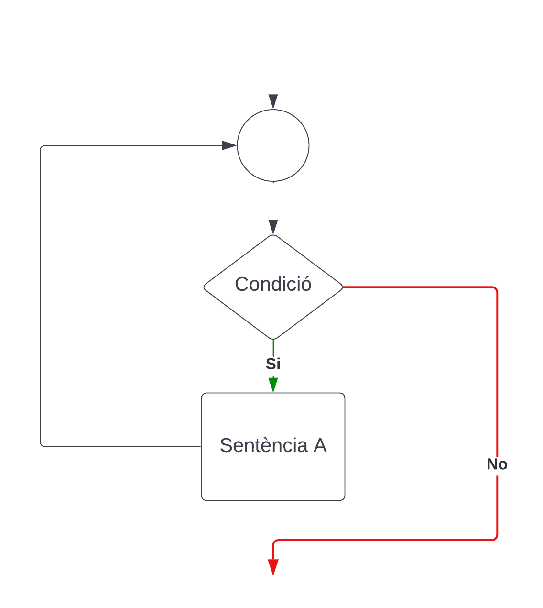

# Desenvolupament de programari

## Concepte de programa informàtic

Un programa informàtic és un conjunt d'instruccions o codi escrit en un llenguatge de programació que és executat per un ordinador per dur a terme una tasca específica.

### Conjunt d'instruccions o codi

Un programa informàtic és fonamentalment un conjunt d'instruccions. Aquestes instruccions estan escrites en un codi, el qual és una representació textual de comandes que l'ordinador pot entendre i executar. Aquest codi pot ser molt complex, des de simples comandes fins a algoritmes avançats i estructures de dades.

### Llenguatge de programació

El codi d'un programa informàtic s'escriu utilitzant un llenguatge de programació. Aquests llenguatges poden variar en complexitat i propòsit, des de llenguatges de baix nivell com l'ensamblador, que està molt a prop de l'idioma de la màquina, fins a llenguatges de més alt nivell com Python o Java, que són més entenedors per humans. Els llenguatges de programació proporcionen un conjunt de regles sintàctiques i semàntiques que s'utilitzen per definir el programa.

### Execució per un ordinador

El codi escrit en un llenguatge de programació és inútil fins que és processat i executat per un ordinador. Aquest procés implica la traducció del codi font, escrit per humans, a una forma que la màquina pugui entendre i executar. Aquesta traducció es pot realitzar a través de la compilació o la interpretació, depenent del llenguatge de programació utilitzat.

### Realització d'una tasca específica

El propòsit principal d'un programa informàtic és dur a terme una tasca específica o resoldre un problema particular. Aquestes tasques poden variar enormement en naturalesa i complexitat, des de l'edició de textos fins al processament de dades complexes, la navegació web, els jocs, la simulació de processos, la gestió d'empreses, entre moltes altres aplicacions.

### Interacció amb el sistema i l'usuari

Molts programes informàtics també interactuen amb altres sistemes informàtics, xarxes, bases de dades i, molt important, amb usuaris humans. Això requereix que els programes no només realitzin tasques internes, sinó també que puguin rebre, processar i enviar dades, així com proporcionar interfícies d'usuari per permetre la interacció humana.

## Procés d'obtenció de codi executable a partir del codi font; eines implicades

Inclou la compilació (transformació del codi font a codi objecte i després a executable) i l'enllaç (linking), així com eines com compiladors, intèrprets i enllaçadors.

El procés d'obtenció de codi executable a partir del codi font implica diverses etapes i eines, les quals transformen el codi escrit en un llenguatge de programació d'alt nivell a un format que un ordinador pot executar directament. Aquest procés pot ser dividit en dues etapes principals: compilació i enllaç (linking).

### Compilació

La compilació és el procés de convertir el codi font escrit en un llenguatge d'alt nivell (com C, Java, o C++) en codi objecte, que és una representació intermediària del programa en un format que l'ordinador pot començar a entendre, però encara no és completament executable.

**Compiladors**: Un compilador és una eina de software que realitza aquesta conversió. Llegeix el codi font, l'analitza (parses), el tradueix, i genera el codi objecte.

**Etapes de Compilació**: Inclou l'anàlisi sintàctica, l'anàlisi semàntica, la generació de codi intermedi, i l'optimització de codi.

### Enllaç (Linking)

Una vegada que el codi font ha estat compilat en codi objecte, el proper pas és l'enllaç. Aquest procés implica combinar el codi objecte amb altres fitxers de codi objecte i llibreries necessàries per crear un fitxer executable.

**Enllaçadors (Linkers)**: Els enllaçadors són eines que prenen un o més fitxers de codi objecte com a entrada i els combinen en un únic fitxer executable. Això inclou la resolució de referències a funcions i variables entre els diferents fitxers de codi objecte.

**Tipus d'Enllaç**: Pot ser estàtic o dinàmic. En l'enllaç estàtic, totes les llibreries i dependències són incorporades en el fitxer executable final. En l'enllaç dinàmic, les referències a llibreries externes es resolen en temps d'execució.

### Intèrprets

Alguns llenguatges, com Python, utilitzen intèrprets en lloc de compiladors. Un intèrpret executa directament el codi font, traduint-lo a codi de màquina en temps real.

**Funcionament**: Un intèrpret llegeix el codi font, l'analitza, i executa les instruccions directament. Això pot fer que l'execució sigui més lenta en comparació amb un programa compilat, però permet una major flexibilitat, com la modificació del codi en temps d'execució.

### Altres Eines

**Optimitzadors**: Alguns compiladors inclouen optimitzadors que milloren l'eficiència del codi objecte generat.

**Depuradors (Debuggers)**: Aquests són utilitzats per trobar i corregir errors en el codi font.

## Codi font, codi objecte i codi executable; tecnologies de virtualització

### Codi Font

El codi font és el conjunt d'instruccions i declaracions escrites en un llenguatge de programació comprensible per humans. Aquest codi és la forma més directa en què els programadors creen i modifiquen programes.

Normalment, es troba organitzat en fitxers de text i utilitza elements com variables, funcions, classes, i altres estructures de programació. La seva llegibilitat i estructura són clau per al desenvolupament i manteniment de software.

El codi font és essencial en el procés de desenvolupament, ja que és la base sobre la qual es construeix tot el programa. També és un component clau en la revisió de codi, depuració, i col·laboració entre desenvolupadors.

### Codi Objecte

El codi objecte és el resultat de la compilació del codi font. És un conjunt de fitxers que contenen codi en un format que l'ordinador comença a entendre, però que encara no és completament executable.

Aquest codi és sovint en format binari o en un format intermedi com el codi de bytes. Encara que no és directament llegible per humans, és més proper al llenguatge de màquina que el codi font.

El codi objecte es genera quan un compilador tradueix el codi font. Aquest procés inclou la traducció de les instruccions de programació d'alt nivell a instruccions que l'ordinador pot començar a processar.

### Codi Executable

El codi executable és el codi binari que pot ser directament executat per un ordinador per realitzar les tasques definides pel programari.

Es crea a partir del codi objecte, on un enllaçador (linker) combina diversos fitxers de codi objecte i les llibreries necessàries per formar un únic fitxer executable.

Quan s'executa un programa, el sistema operatiu carrega aquest codi executable a la memòria de l'ordinador i comença a executar les instruccions binàries.

### Tecnologies de Virtualització

La virtualització es refereix a la creació d'una versió virtual d'un recurs tecnològic. Això pot incloure sistemes operatius, servidors, dispositius d'emmagatzematge, i xarxes.

Mitjançant el software de virtualització, es pot executar múltiples sistemes operatius i aplicacions en un sol equip físic. Això s'aconsegueix separant les capes de hardware dels sistemes operatius i aplicacions.

La virtualització és àmpliament utilitzada en centres de dades per optimitzar l'ús dels recursos, proporcionar entorns de prova aïllats, i millorar l'eficiència i l'escalabilitat dels serveis informàtics.

A l'assignatura, veurem dos tipus de màquines virtuals:

**Màquina virtual de sistema**: És una aplicació que emula un ordinador per complet, pots posar un SO amb un disc dur, memòria… Per exemple Virtual Box.

**Màquina virtual en procés**: Executen un procés concret dins el SO. L’objectiu és aconseguir que un programa s’executi igual a qualsevol plataforma. Per exemple la màquina virtual de java (JVM).

## Tipus de llenguatges de programació. Paradigmes

Els llenguatges de programació poden ser classificats segons diversos criteris, com el nivell d'abstracció, el propòsit per al qual van ser dissenyats, i els paradigmes de programació que suporten. A continuació es descriuen alguns dels tipus més rellevants.

### Segons el nivell d'abstracció

El nivell d’abstracció d’un llenguatge implica quan llunyà està del codi màquina, com més semblant sigui al nostre llenguatge més enfora estem del codi màquina, per tant, serà de major nivell.

**Llenguatges de baix nivell**: Només hi ha un llenguatge de primera generació, el codi màquina.

**Llenguatges de nivell mitjà**: Són més propers al codi màquina i inclouen llenguatges com l'Ensamblador. Ofereixen un control molt gran sobre el hardware, però són més difícils d'aprendre i utilitzar eficaçment.

**Llenguatges d'alt nivell**: La majoria dels llenguatges que s’empren avui en dia per a programar aplicacions són d’alt nivell. Són molt propers al nostre propi llenguatge i permeten la realització de patrons de disseny complex com Java o C#. A aquest nivell també trobem els destinats a un propòsit específic com seria SQL.

### Segons el propòsit

**Llenguatges de Propòsit General**: Són dissenyats per a ser utilitzats en una àmplia varietat d'aplicacions. Exemples inclouen Python, Java, i C++.

**Llenguatges de Propòsit Específic**: Són dissenyats per a tasques específiques. Per exemple, SQL per a consultes de bases de dades, HTML per a la creació de pàgines web, o R per a anàlisi estadística.

### Segons la forma d’execució

**Compilats**: Un programa traductor (compilador) converteix el codi font en codi objecte, i un enllaçador (linker) tradueix el codi objecte en codi executable. Exemples: C, C++, Go.

**Interpretats**: Executen les instruccions directament, sense generar codi objecte. La mateixa màquina s’encarrega d’interpretar-ho instrucció a instrucció. Exemples: Python, JavaScript, Ruby.

**Virtuals**: Tenen un comportament similar als llenguatges compilats amb la diferència que el compilador no genera codi objecte sinó bytecode. Una màquina virtual s’encarrega d’interpretar el bytecode per a executar-ho en el sistema. Exemples: Java, .NET.

### Segons els paradigmes de programació

**Imperatiu**: Descriu la programació com una seqüència d’instruccions que canvien l’estat del programa, indicant com dur a terme una tasca. Exemples: Java, C, C++, Python, Ruby.

**Declaratiu**: Especifica o declara un conjunt de premisses i condicions per a indicar que és el que ha de fer i no necessàriament com cal fer-ho. Exemples: Prolog, Lisp, SQL.

**Procedimental**: El programa es divideix en parts més petites, anomenades funcions i procediments, que poden comunicar-se entre si. Permet reutilitzar codi ja programat i resol el problema de la programació espagueti. Exemples: Java, C, C++, Python, Ruby.

**Funcional**: avalua el problema realitzant funcions de manera recursiva, evita declarar dades donant importància a la composició de les funcions i a les interaccions entre elles. Exemples: Java, C, C++, Python, Ruby.

**Orientat a objectes (OO)**: encapsula l’estat i les operacions en objectes, creant una estructura de classes i objectes que sembla un món real, on els objectes realitzen accions i interactuen amb altres objectes. Exemples: Java, Python, Ruby.

**Lògic**: defineix un conjunt de regles lògiques per a ser interpretades mitjançant inferències lògiques. Permet respondre qüestions plantejades al sistema per a resoldre problemes. Exemples: Prolog

## Característiques dels llenguatges més difosos

Imagineu que la programació és com construir un edifici amb diferents tipus de peces de Lego. En aquesta metàfora, la programació estructurada seria una manera especial d'utilitzar només tres tipus de peces per construir qualsevol cosa que vulgueu. Aquesta idea va ser desenvolupada per Edsger W. Dijkstra.

El "teorema de l'estructura" que va idear Dijkstra diu que només amb tres estructures (seqüència, selecció i iteració), podeu construir qualsevol tipus de programa, sense necessitat d'usar salts aleatoris o desordenats (com el famós _GOTO_ en programació, que seria com saltar a una peça de Lego aleatòria en lloc de seguir un patró ordenat).

És a dir, la programació estructurada manté les coses ordenades i previsibles, com seguir un manual d'instruccions de Lego, en lloc de saltar per tot arreu de manera caòtica. Això fa que els programes siguin més fàcils d'entendre i de corregir, sobretot per a qui està començant a aprendre a programar.

### Seqüència

Les instruccions són executades successivament, una darrere l’altra.

Això és com posar peces de Lego una darrere de l'altra en una fila. En programació, això significa fer una tasca després de l'altra, en un ordre específic.

A continuació es pot observar un exemple de l’estructura bàsica de seqüència, on primer s’executarà la sentència A i, posteriorment, la B.

```
Sentència A
Sentència B
```

### Selecció

Representa la instrucció condicional amb doble alternativa.

Imagineu que arribeu a un punt on podeu posar una peça vermella o una peça blava, però la vostra elecció depèn de si, per exemple, avui és dilluns o dimarts. En programació, això seria com escriure un codi que pot prendre decisions basades en certes condicions. Si passa una cosa (és dilluns), farem una acció; si passa una altra (és dimarts), farem una acció diferent.

```
Si (condició) llavors
    Sentència A
Sinó
    Sentència B
Fisi
```

### Iteració

Representa el bucle condicional.

Aquesta és com si decidíssiu construir una torre fent el mateix patró de peces una vegada i una altra fins a assolir una certa altura. En programació, iteració significa repetir una acció (com un conjunt de passos) moltes vegades, com un bucle.

```
mentre condició, fes:
    Sentència A
fi mentres
```

En aquest cas, s'executaran les instruccions de la _sentència A_ repetidament mentre la condició es compleixi.

### Diagrames de flux o d’activitat

El diagrames de flux o diagrames d'activitat són la representació gràfica d'un algorisme o procés. S'utilitza en disciplines com ara programació, economia, processos industrials i psicologia cognitiva.

Aquests diagrames utilitzen símbols amb significats definits que representen els passos de l'algorisme, i representen el flux d'expulsió mitjançant fletxes que connecten els punts d'inici i final del procés.

#### Expressions bàsiques

Els diagrames d’activitats fan servir una sèrie d’elements, com ara:

- **Estats inicials**, representats mitjançant un cercle omplert de color negre. Marquen l’inici de l’execució dels processos o activitats.
- **Estats finals**, representats mitjançant un cercle omplert de color negre amb una altra circumferència per sobre amb una petita distància sense omplir. Els estats finals indiquen el final de l’execució d’un procés o activitat.
- **Activitats o accions**, representades mitjançant un rectangle de cantonades arrodonides. Indiquen l’arribada a un node una vegada efectuada una acció o activitat.
- **Transicions o fluxos de control**, representats mitjançant fletxes. La seva direcció indica el node des del qual s’inicia l’activitat o l’acció fins a l’altre node, al qual s’arribarà una vegada finalitzada.

#### Representació visual de les expressions bàsiques

| Símbol                              | Nom             | Funció                                                                                                                                                                                                                              |
| ----------------------------------- | --------------- | ----------------------------------------------------------------------------------------------------------------------------------------------------------------------------------------------------------------------------------- |
|       | Línia de flux   | Mostra l'ordre de funcionament dels processos.                                                                                                                                                                                      |
|        | Inici/final     | Indica l'inici o el final d'un programa o subprocés. Normalment, conté les paraules "Inici" o "Fi", o altres paraules que indiquen l'inici o el final d'un procés, com ara "presentar la consulta" o "rebre el producte". |
|            | Procés          | Representa un conjunt d'operacions que canvien el valor, la forma o la ubicació de les dades.                                                                                                                                       |
|          | Decisió         | Representa una operació condicional que determina quines rutes seguirà el programa.​ L'operació sol ser una pregunta de si/no o una prova de verdader/fals.                                                                         |
|  | Entrada/sortida | Representa l'entrada o sortida de dades, generalment per fluxos estàndard.                                                                                                                                                          |

#### Construcció d'estructures

##### Seqüència


##### Selecció



##### Iteració



## Fases del desenvolupament d'una aplicació

El desenvolupament d'una aplicació es divideix en diverses fases clau, cadascuna amb el seu propòsit i importància dins del cicle de vida del desenvolupament de software. Aquestes fases són:

- **Anàlisi**: Definició de requisits i necessitats del sistema.
- **Disseny**: Planificació de l'estructura del sistema.
- **Codificació**: Escriptura del codi font.
- **Proves**: Verificació i validació del software.
- **Documentació**: Creació de manuals i documentació tècnica.
- **Explotació**: Implementació i ús del sistema en un entorn real.
- **Manteniment**: Actualitzacions i correccions del sistema.

El desenvolupament d'una aplicació es divideix en diverses fases clau, cadascuna amb el seu propòsit i importància dins del cicle de vida del desenvolupament de software. Aquestes fases són:

### 1. Anàlisi

Aquesta fase implica comprendre i definir els requisits i necessitats del sistema. Es realitza una recopilació detallada d'informació per entendre les expectatives dels usuaris finals, els objectius del negoci, i les restriccions tècniques.

**Activitats**: Inclou entrevistes amb stakeholders, anàlisi de processos de negoci, i l'elaboració de documents de requisits.

**Resultat**: Els requisits funcionals i no funcionals del sistema són clarament definits i documentats.

### 2. Disseny

En aquesta etapa, es planifica l'estructura global del sistema. Es converteixen els requisits identificats en una arquitectura de software i un disseny detallat.

**Activitats**: Inclou la creació de diagrames d'arquitectura, models de dades, i dissenys d'interfície d'usuari.

**Resultat**: Un pla detallat que guia la fase de codificació, incloent-hi models, esquemes de base de dades, i dissenys d'interfície.

### 3. Codificació

Aquesta fase és on es crea el codi font del programa basat en el disseny definit.

**Activitats**: Els desenvolupadors escriuen el codi utilitzant llenguatges de programació apropiats, seguint les millors pràctiques i estàndards de codificació.

**Resultat**: Un producte de software funcional, encara que inicialment pot tenir errors o necessitar millores.

### 4. Proves

Les proves són crucials per assegurar la qualitat i la funcionalitat del software.

**Activitats**: Inclouen proves unitàries, d'integració, de sistema, i d'acceptació per l'usuari. Es busquen errors, bugs, i qualsevol desviació dels requisits originals.

**Resultat**: Un software validat i verificat, preparat per a la seva implementació.

### 5. Documentació

La documentació és essencial per a l'ús, manteniment i comprensió futura del sistema.

**Activitats**: Creació de manuals d'usuari, documentació tècnica del codi, i guies d'instal·lació i configuració.

**Resultat**: Documentació completa que facilita la utilització i el manteniment del sistema.

### 6. Explotació

Després de les proves i la documentació, el sistema es posa en marxa en un entorn real.

**Activitats**: Inclou la implementació del software, la formació dels usuaris, i el suport inicial.

**Resultat**: El software està en funcionament i disponible per als usuaris finals.

### 7. Manteniment

La fase de manteniment comença després de la implementació i dura tota la vida del sistema.

**Activitats**: Inclouen correccions d'errors, actualitzacions, i millores en resposta a canvis en els requisits o l'entorn tecnològic.

**Resultat**: Un sistema actualitzat, segur, i alineat amb les necessitats canviants dels usuaris i de l'empresa.

## Metodologies àgils. Tècniques. Característiques

Les metodologies àgils són enfocaments moderns en el desenvolupament de software que es distingeixen per la seva flexibilitat, adaptabilitat i enfocament en el lliurament ràpid i contínua de valor al client.

En 2001 es va publicar l'Agile Manifesto, un document que inclou els 4 valors i els 12 principis en els quals es basa el desenvolupament àgil. Els valors són els següents:

- Individus i interaccions per sobre de processos i eines.
- Programari que funciona per sobre de documentació exhaustiva.
- Col·laboració amb el client per sobre de negociació de contractes.
- Resposta al canvi per sobre de cenyir-se a una planificació.

Tot i que existeixen diverses metodologies de programació àgil, en aquests materials ens enfocarem en **Scrum**, ja que és la més utilitzada.

Aquesta metodologia inclou la utilització d’eines com són els **esprints** per planificar cada iteració, les **històries d’usuari** per recollir els requisits, els **taulells Kanban** per gestionar les tasques i la realització de diferents tipus de **reunions** durant cada iteració.

### Reunions

**Retrospectiva**: al final de cada iteració es fa una anàlisi retrospectiva per determinar si s’han complert els objectius, si s’ha trobat algun entrebanc i com es pot evitar en el futur… La finalitat és millorar els processos per les següents iteracions.

**Ordenar el backlog**: les tasques del backlog s’ordenen de major a menor prioritat, de manera que al principi de la llista es trobaran les tasques més prioritàries.

**Planificació de la iteració (esprint)**: reunió en la qual es planifica la següent iteració, es reordena el backlog, s’ajusten les estimacions, s’actualitzen les històries amb la informació obtinguda al llarg d’aquesta iteració… Aquesta primera anàlisi fa possible definir l’abast de l’aplicació, facilita la planificació i aclareix els possibles malentesos respecte a les necessitats de l’aplicació.

**Daily Standup (reunions diàries dempeus)**: són reunions curtes (menys de 15 minuts) per mantenir a tothom informat de l’estat del projecte, si hi ha algun entrebanc… Les tres preguntes que es fan és:

- Que va completar ahir l’equip?
- Quin és l’objectiu per avui?
- Hi ha alguna tasca o objectiu bloquejat per algun motiu?

### Eines

Els **taulells kanban** són utilitzats molt freqüentment en les metodologies àgils i la seva funció és ajudar-nos a organitzar les nostres tasques segons la seva prioritat i el seu estat.

Consisteix en un seguit de **columnes** on la columna de l’esquerra conté totes les **tasques pendents** i a la dreta les **tasques completades**. Entremig hi ha un nombre variable de columnes, que representa l’estat, per les que es van desplaçant les tasques fins a ser completades.

No és obligatori fer servir cap programari especial per fer servir un taulell kanban, es pot usar una pissarra per pintar les columnes i uns post-its per representar les tasques.

Per organitzar un projecte fent servir un taulell kanban **primerament cal dividir el projecte en tasques** i crear una targeta al taulell per cada tasca. Aquesta pila inicial que conté totes les tasques que formen el projecte s’anomena **Backlog**.

Exemple d'estat de les tasques:

- Backlog / Product Backlog: totes les tasques pendents.
- Pendents / Sprint Backlog: tasques planificades per portar a terme en l’esprint actual.
- Fent / En desenvolupament: tasques en les quals s’està treballant actualment
- Test / Testing: tasques completades, pendent de revisió o testatge.
- Completes: tasques completades.
